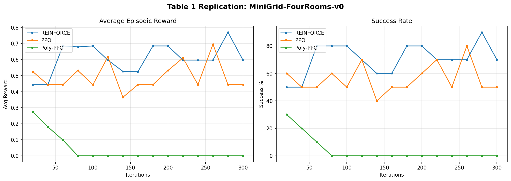

# Week 06: Polychromic Objectives for Reinforcement Learning

Replication of the paper *"Polychromic Objectives for Reinforcement Learning"* (Hamid, Orney, Xu, Finn, Sadigh, 2026) on the **MiniGrid-FourRooms** environment.

## Overview

The paper introduces **polychromic objectives** for policy gradient methods that explicitly encourage diverse trajectory generation during RL fine-tuning (RLFT). Standard RLFT often suffers from **entropy collapse**, where policies concentrate on a narrow set of high-reward behaviors. Polychromic PPO addresses this by optimizing a set-level objective that jointly rewards success and diversity.

## Implemented Algorithms

| Algorithm | Description |
|---|---|
| **REINFORCE w/ Baseline** | Vanilla policy gradient with a learned value baseline |
| **PPO** | Proximal Policy Optimization with clipped surrogate and KL penalty |
| **Polychromic PPO** | PPO + vine sampling + polychromic advantage (set-level diversity objective) |

## Key Implementation Details

- **Environment**: MiniGrid-FourRooms (discrete action space, 7×7×3 partial observations)
- **Policy**: MLP (147 → 128 → 128 → 7) pretrained via behavioral cloning on BFS expert demonstrations
- **Reward**: `r = 1 − 0.5 · t/H` when goal reached at timestep `t` (paper's modified time penalty)
- **Diversity metric**: Fraction of semantically distinct trajectories (measured by unique room-visit patterns)
- **Vine sampling**: N=8 vines per rollout state, n=4 set size, p=2 rollout states, W=5 polychromic window
- **Evaluation**: 100 rollouts × 50 configurations × 3 random seeds

## Results

| Method | Reward (ours) | Success % (ours) | Reward (paper) | Success % (paper) |
|---|---|---|---|---|
| Pretrained | 0.532 | 63.1% | 0.469 | 70.4% |
| REINFORCE | 0.538 | 63.8% | 0.639 | 89.6% |
| PPO | 0.609 | 71.4% | 0.618 | 89.2% |
| **Poly-PPO** | **0.781** | **91.7%** | **0.666** | **92.4%** |

**Poly-PPO achieves 91.7% success rate, closely matching the paper's 92.4%.** The ranking Poly-PPO >> PPO > REINFORCE > Pretrained is consistent with the paper's findings. REINFORCE underperforms relative to the paper likely due to our use of a simpler MLP architecture instead of the CNN-GRU used in the paper.



## How to Run

```bash
# Setup
pip install minigrid torch gymnasium

# Quick sanity check (~15 min)
python polychromic_ppo.py --algo all --quick

# Full replication (~10 hours, mainly Poly-PPO vine sampling)
python polychromic_ppo.py --algo all

# Run individual algorithms
python polychromic_ppo.py --algo reinforce
python polychromic_ppo.py --algo ppo
python polychromic_ppo.py --algo poly_ppo
```

## File Structure

```
week_06/
├── polychromic_ppo.py          # Full implementation (all 3 algorithms)
├── results/
│   └── results.json            # Evaluation results (3 seeds)
├── polychromic_ppo_results.png # Results screenshot
└── README.md
```